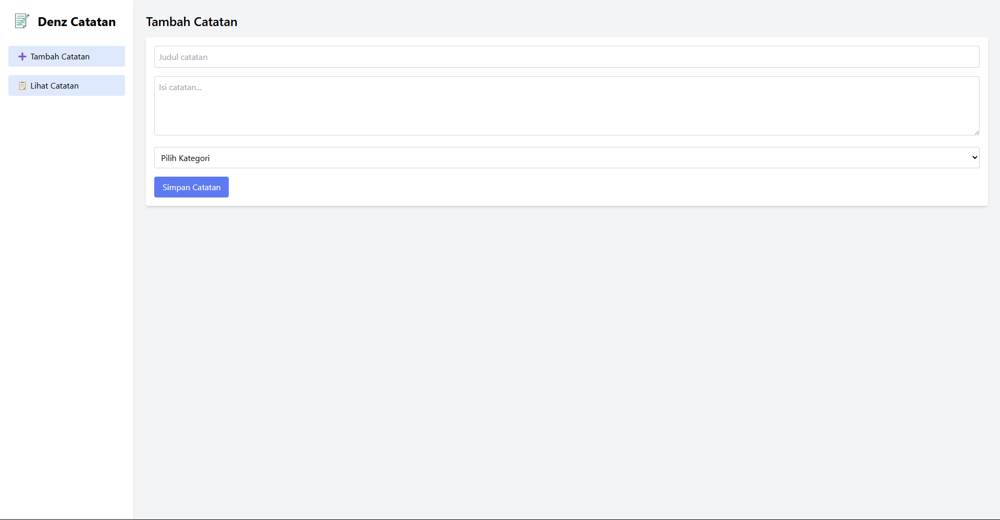
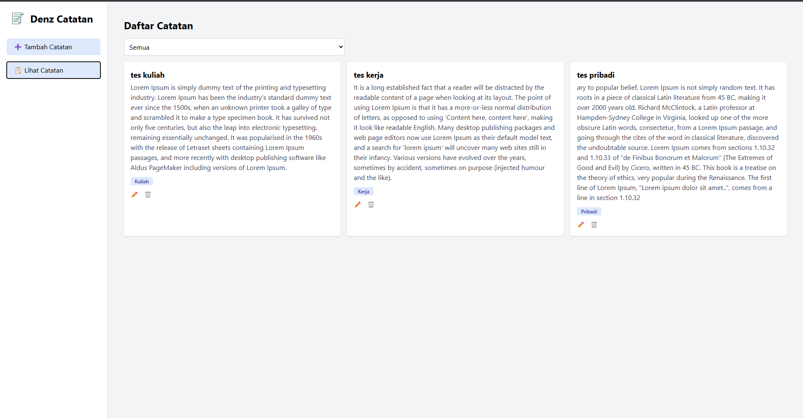

# Denz Catatan

Ini merupakan aplikasi personal dashboard sederhana untuk mencatat dan mengelola catatan harian, seperti catatan untuk kuliah, pekerjaan, atau pribadi. Aplikasi ini diperuntukan untuk mahasiswa yang ingin mencatat hal penting seperti jadwal kuliah, to-do list, atau catatan pribadi.

## Fitur Aplikasi

- **Tambah Catatan**: Isi judul, isi, dan kategori catatan (Kuliah, Kerja, Pribadi).
- **Lihat dan Filter Catatan**: Lihat semua catatan dan filter berdasarkan kategori.
- **Edit Catatan**: Sunting catatan yang sudah disimpan.
- **Hapus Catatan**: Hapus catatan yang tidak dibutuhkan.
- **Penyimpanan Otomatis**: Data disimpan menggunakan `localStorage`, tidak hilang saat halaman di-refresh.

---

## Tools yg digunakan

- HTML5 + JavaScript ES6+
- Tailwind CSS
- localStorage API (untuk penyimpanan)

---

## Fitur ES6+ yang Diimplementasikan

| Fitur ES6+                      | Implementasi                              |
| ------------------------------- | ----------------------------------------- |
| `let` dan `const`               | Untuk deklarasi variabel                  |
| Arrow Function                  | Pada `forEach`, event listener, dll.      |
| Template Literals               | Untuk isi card catatan (`createNoteCard`) |
| Fungsi Asinkron (`async/await`) | Pada `fetchCategories()`                  |
| `Class`                         | Class `Note` untuk membuat objek catatan  |
