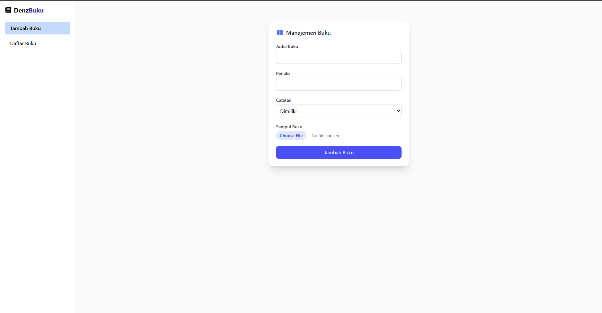
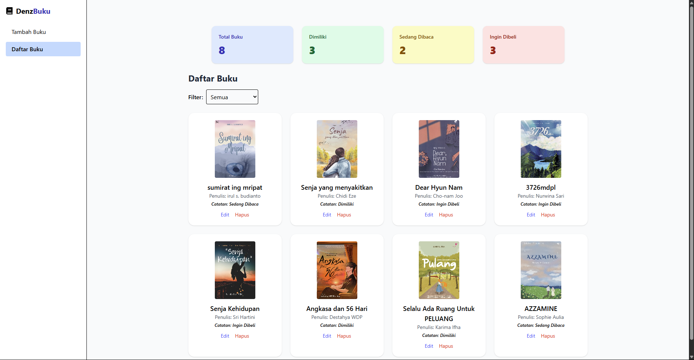
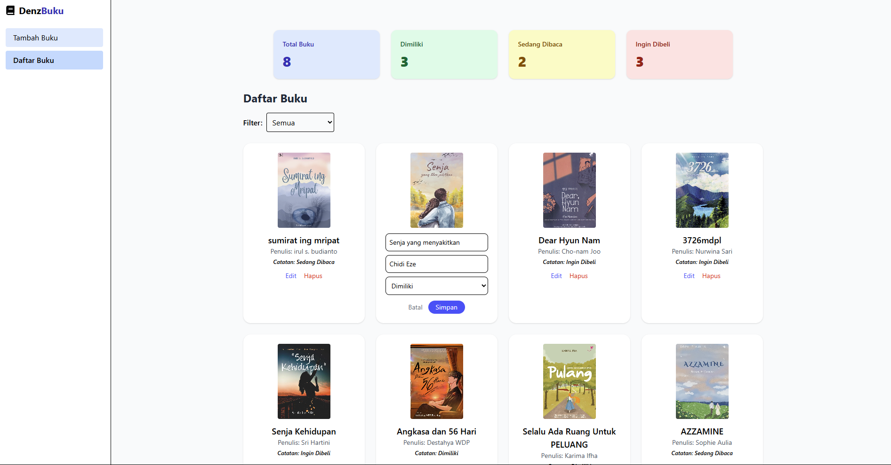

# Denz Buku

Ini merupakan aplikasi manajemen buku pribadi sederhana yang berguna untuk mencatat buku-buku yang dimiliki, sedang dibaca, atau ingin dibeli. Aplikasi ini diperuntukan untuk pengguna yang ingin mengatur daftar buku buku pribadi nya.

## Instalasi

1. Clone repositori:

```bash
git clone https://github.com/EdenWijaya/pemrograman_web_itera_122140187.git
```

2. Install dependensi :

```bash
npm install
```

3. Jalankan aplikasi :

```bash
npm run dev
```

4. Buka browser dan akses :

```bash
http://localhost:5173
```

## Screenshoot







## Fitur React yg digunakan

| Fitur ES6+  | Implementasi                                                          |
| ----------- | --------------------------------------------------------------------- |
| UseState    | Mengelola state lokal seperti title, author, status, dan image        |
| useEffect   | Mengisi form dengan data awal ketika melakukan edit buku              |
| Context API | Untuk menyimpan dan membagikan data buku ke seluruh komponen aplikasi |
| PropTypes   | Melakukan type-checking pada properti (props) di komponen BookForm    |

## Teknologi

- [React](https://reactjs.org/)
- [Tailwind CSS](https://tailwindcss.com/)
- [uuid](https://www.npmjs.com/package/uuid)
- [PropTypes](https://reactjs.org/docs/typechecking-with-proptypes.html)
